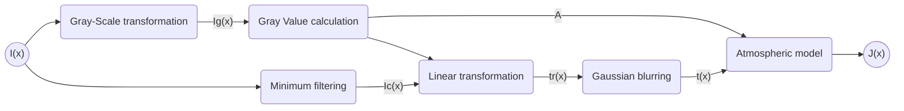

# Documentation for Dehazing


Project is an implementation of this paper http://dx.doi.org/10.1109/TMM.2017.2652069

The paper tries to work it's way backwards from a hazy to a non hazy image using this equation: $I(x) = J(x)t(x) + A(1-t(x))$

* $I(x)$ is the hazy image
* $J(x)$ is the non hazy image
* $A$  is the atmospheric light
* $t(x)$ is the medium transmission map

### Steps involved



* **Gray-Scale transformation**: Conversion of RGB hazy image to grayscale.

* **Gray Value calculation:** Calculating mean of the top x% brightest pixels of the hazy image. Gives $A$

* **Minimum filtering**: Finding the color channel with minimum intensity in all the pixels. Gives $\text{min }I_c(x)$

* **Linear Transformation**: Using $A$ and hazy image to calculate $t_r(x)$ using the formula $t_r(x) = \frac{A - \text{min }I_c(x)}{A - \delta \times \frac{\text{min }I_c(x) - \text{min} \left(\text{min }I_c(x)\right)}{\text{max} \left(\text{min }I_c(x)\right) - \text{min} \left(\text{min }I_c(x)\right)}\times \text{min }I_c(x)}$  where $\delta$ is the control factor. 

* **Gaussian blurring**: $t(x) = t_r(x)^*G$ where $G$ is the Gaussian window.

* **Atmospheric Model**: Finally retrieving the dehazed image using the formula $J(x) = \frac{I(x)-A}{max(t(x),t_0)} + A $ 

  where $t_0$ is the lower bound on the value of $t(x)$

### Code

The paper is implemented in `dehazing.py`. Specific scripts for dehazing images and video are made separately: `dehazing_images.py` and `dehazing_video.py`

* `dehazing.py` 

  Contains the `Dehazing` module containing all the required functions:

  * `__init__(self, delta, sigma, brightness_gain, kernel)` 
    * delta is the control factor
    * sigma is the variance for the gaussian distribution
    * brightness_gain is for increasing brightness as a post processing step
    * kernel is the window for gaussian filter

  * `self.psnr(img1, img2)` takes two ndarrays of two images as input and outputs the Peak Signal-to-Noise Ratio
  * `self.ssim(img1, img2)` takes two ndarrays of two images as input and outputs the Structural Similarity between them
  * `self.atmospheric_light(img, x)` calculates atmospheric light using the hazy image and x. This is the "Gray value calculation" step
  * `self.transmission_map(A, minIc)` calculates transmission map using the atmospheric light (A) and minimum color channel (minIc). This includes the "Linear Transformation" and "Gaussian blurring" step
  * `self.recover_image(img, A, t)` recovering the dehazed image using the atmospheric light(A) and transmission map (t). This is the "Atmospheric Model" step
  * `self.dehaze(img)` puts the previous three functions together

#### Example

```py
import cv2
from dehazing import Dehazing

dehazer = Dehazing(delta=0.4, sigma=100, brightness_gain=1.15, kernel=(101, 101))
img = cv2.imread("hazy_image.png")
dh_img = dehazer.dehaze(img)

cv2.imshow("hazy", img)
cv2.imshow("dehazed", dh_img)
cv2.waitKey(0)
```


